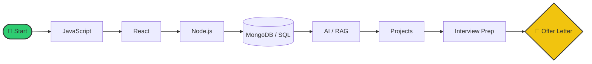
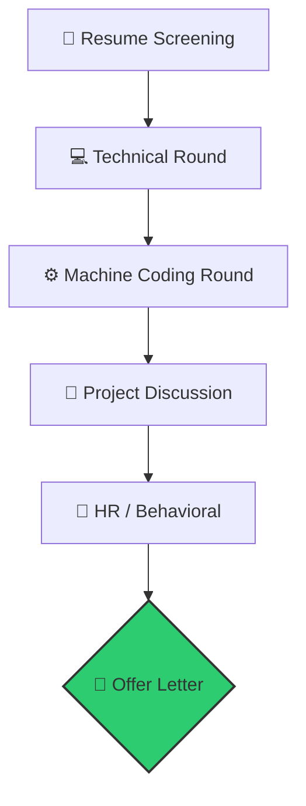

<!-- Typing SVG Header -->
<div align="center">
  
</div>

<div align="center">

[](https://github.com/sohamkundu)
[](https://github.com/sohamkundu)
[](https://opensource.org/licenses/MIT)
[](https://github.com/sohamkundu)
[](https://github.com/sohamkundu)

</div>

<div align="center">
  
</div>

---

## 🚀 Who is this for?
- ✔ **Freshers**
- ✔ **Internship Seekers**
- ✔ **MERN Developers**
- ✔ **AI Engineers**
- ✔ Product & Service Companies

---

## 📈 Repository Metrics
```text
📚 23 Sections         ❓ 4000+ Questions
💻 250 DSA Problems    ⚡ 300 Rapid Fire
🏢 20+ Companies       🧠 30-Day Plan
🚀 3 Major Projects    📖 150 Resume Questions
```

---

## 📚 Table of Contents
<div align="center">

| Section | Topic | Section | Topic |
| :---: | :--- | :---: | :--- |
| 1️⃣ | [Programming Fundamentals](./Section_01_Programming_Fundamentals.md) | 2️⃣ | [JavaScript](./section_02_Javascript.md) |
| 3️⃣ | [React](./Section_03_React.md) | 4️⃣ | [Node.js](./Section_04_NodeJS.md) |
| 5️⃣ | [MongoDB](./Section_05_MongoDB.md) | 6️⃣ | [SQL](./Section_06_SQL.md) |
| 7️⃣ | [System Design Basics](./Section_07_SystemDesign.md) | 8️⃣ | [Operating Systems](./Section_08_OS.md) |
| 9️⃣ | [Computer Networks](./Section_09_ComputerNetworks.md) | 🔟 | [DBMS](./Section_10_DBMS.md) |
| 1️⃣1️⃣ | [Git & GitHub](./Section_11_Git.md) | 1️⃣2️⃣ | [Docker](./Section_12_Docker.md) |
| 1️⃣3️⃣ | [REST API](./Section_13_REST_API.md) | 1️⃣4️⃣ | [Authentication](./Section_14_Authentication.md) |
| 1️⃣5️⃣ | [AI & LLMs](./Section_15_AI.md) | 1️⃣6️⃣ | [Machine Learning](./Section_16_MachineLearning.md) |
| 1️⃣7️⃣ | [Project Deep Dives](./Section_17_Projects.md) | 1️⃣8️⃣ | [Behavioral Interview](./Section_18_Behavioral.md) |
| 1️⃣9️⃣ | [Resume Based Questions](./Section_19_Resume.md) | 2️⃣0️⃣ | [Coding Round (250 DSA)](./Section_20_CodingRound.md) |
| 2️⃣1️⃣ | [Rapid Fire (300 Qs)](./Section_21_RapidFire.md) | 2️⃣2️⃣ | [Top 100 Questions](./Section_22_Top100.md) |
| 2️⃣3️⃣ | [Mistakes Freshers Make](./Section_23_Mistakes.md) | - | - |

</div>

---

## 🗺️ The Learning Path



---

## 📅 The 30-Day Roadmap

> [!TIP]
> **Consistency beats intensity.** 2 Hours of Theory + 1 Hour of DSA daily.

<details>
<summary><b>🟢 WEEK 1: Frontend Mastery</b></summary>

```text
┌─────────────────────────────┐
│ 🟢 WEEK 1                   │
│ Frontend Mastery            │
│ JS • React • Arrays         │
│ ⏱ 7 Days                   │
└─────────────────────────────┘
```

- [ ] **Day 1:** JS Engine & Core + Array Easy Q1-Q5
- [ ] **Day 2:** Asynchronous JS & ES6+ + Array Easy Q6-Q10
- [ ] **Day 3:** React Fundamentals + Math Easy Q11-Q15
- [ ] **Day 4:** Advanced React & State + Math Easy Q16-Q20
- [ ] **Day 5:** Programming Fundamentals (C++/Python) + Math Easy Q21-Q25
- [ ] **Day 6:** CampusHub Project Defense + String Easy Q26-Q30
- [ ] **Day 7:** Rest & Rapid Fire (1-50) + String Easy Q31-Q35
</details>

<details>
<summary><b>🔵 WEEK 2: Backend, API & Databases</b></summary>

```text
┌─────────────────────────────┐
│ 🔵 WEEK 2                   │
│ Backend & Databases         │
│ Node • Mongo • SQL • APIs   │
│ ⏱ 7 Days                   │
└─────────────────────────────┘
```

- [ ] **Day 8:** Node.js Internals + String Easy Q36-Q40
- [ ] **Day 9:** REST API & Authentication + String Easy Q41-Q45
- [ ] **Day 10:** MongoDB Deep Dive + Linked List Easy Q46-Q50
- [ ] **Day 11:** SQL & RDBMS + Linked List Easy Q51-Q55
- [ ] **Day 12:** System Design & Architecture + Linked List Easy Q56-Q60
- [ ] **Day 13:** Portfolio OS Project Defense + Search/Sort Easy Q61-Q65
- [ ] **Day 14:** Rest & Mistakes Review + Search/Sort Easy Q66-Q70
</details>

<details>
<summary><b>🟣 WEEK 3: Core CS & AI Integration</b></summary>

```text
┌─────────────────────────────┐
│ 🟣 WEEK 3                   │
│ Core CS & GenAI             │
│ OS • CN • LLMs • RAG        │
│ ⏱ 7 Days                   │
└─────────────────────────────┘
```

- [ ] **Day 15:** Computer Networks + Trees Easy Q71-Q75
- [ ] **Day 16:** Operating Systems + Trees Easy Q76-Q80
- [ ] **Day 17:** AI Fundamentals & Prompt Eng + Trees Easy Q81-Q85
- [ ] **Day 18:** RAG, Gemini & Groq APIs + Stacks/Queues Easy Q86-Q90
- [ ] **Day 19:** Git & Docker + Stacks/Queues Easy Q91-Q95
- [ ] **Day 20:** SupportGPT Project Defense + Stacks/Queues Easy Q96-Q100
- [ ] **Day 21:** Rest & Top 100 Review (Service Based) + Array Medium Q101-Q105
</details>

<details>
<summary><b>🟠 WEEK 4: The Final Polish</b></summary>

```text
┌─────────────────────────────┐
│ 🟠 WEEK 4                   │
│ Mock Interviews & DSA       │
│ HR • Resumes • Top 100      │
│ ⏱ 7 Days                   │
└─────────────────────────────┘
```

- [ ] **Day 22:** Resume Grilling (Part 1) + Array Medium Q106-Q110
- [ ] **Day 23:** Machine Learning Basics + Array Medium Q111-Q115
- [ ] **Day 24:** Resume Defense (Part 2) + Two Pointers Medium Q121-Q125
- [ ] **Day 25:** Behavioral & HR (STAR Method) + Binary Search Medium Q136-Q140
- [ ] **Day 26:** Top 100 FAANG & Startups + Linked List Medium Q146-Q150
- [ ] **Day 27:** Full MERN Stack Revision + Trees/Graphs Medium Q161-Q165
- [ ] **Day 28:** Full AI / Core CS Revision + DP Medium Q181-Q185
</details>

<details>
<summary><b>🏆 THE FINAL 48 HOURS</b></summary>

- [ ] **Day 29:** Rapid Fire Gauntlet (All 300 Qs) + Explain 5 Hard DSA
- [ ] **Day 30:** Mental Prep & Sleep. You are ready.
</details>

---

## 🌳 Skill Tree

```text
Frontend
   │
   ├── 📄 HTML5
   ├── 🎨 CSS3 / Tailwind
   ├── 🟨 JavaScript
   └── ⚛️ React / Zustand

Backend
   │
   ├── 🟩 Node.js
   ├── 🚂 Express
   └── 🔐 JWT / OAuth

Database
   │
   ├── 🍃 MongoDB
   └── 🐬 MySQL

AI & GenAI
   │
   ├── ✍️ Prompt Engineering
   ├── 🤖 Gemini API
   ├── 🔥 Groq API (LPU)
   └── 📚 RAG Fundamentals

Core CS & Tools
   │
   ├── 🧠 DSA & OOP
   ├── 🖥️ OS & CN
   ├── 🐳 Docker
   └── 🐙 Git & GitHub
```

---

## 🎯 Interview Pipeline



---

## 📊 Progress Bars

```text
JavaScript
██████████░░░ 80%

React
████████░░░░ 65%

DSA
██████░░░░░░ 50%

AI Integrations
█████████░░░ 75%
```

---

## 🏢 Interview Tracker

- [ ] Google
- [ ] Amazon
- [ ] Microsoft
- [ ] Flipkart
- [ ] TCS
- [ ] Infosys
- [ ] Wipro
- [ ] Accenture
- [ ] Startups

---

## 📂 Repository Structure

```text
📂 Interview Notebook
├── 📁 Arrays
├── 📁 Strings
├── 📁 MERN
├── 📁 AI
├── 📁 Projects
├── 📁 HR
├── 📁 DSA
├── 📁 Core CS
└── 📄 README.md
```

---

> [!IMPORTANT]
> **Never memorize answers. Understand concepts.**
> Interviewers can easily tell when a candidate is reciting a memorized definition vs explaining a concept they truly understand.

> [!WARNING]
> **Do not skip OS or Networking.** 
> Many Full Stack freshers fail because they only know React and Node, but cannot explain how DNS or a Thread works.

---

<div align="center">
  <h3>Made with ❤️ by Soham Kundu</h3>
  <p>⭐ If this repository helped you, please give it a Star.</p>
  <p><b>Happy Coding 🚀</b></p>
</div>
