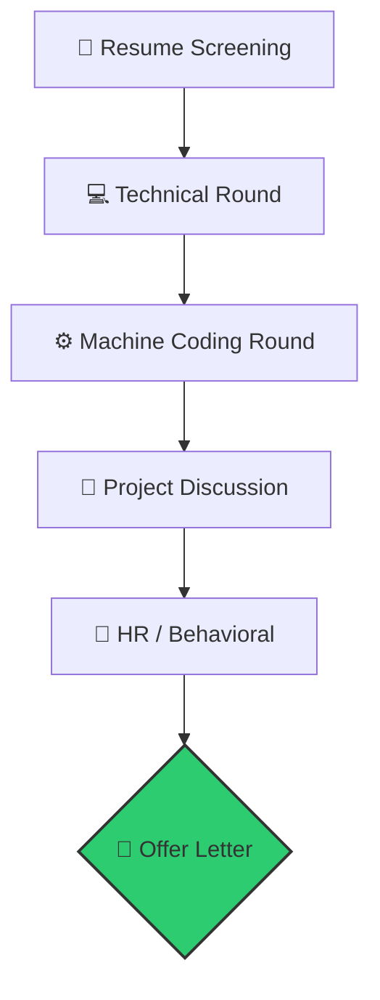

<!-- Typing SVG Header -->
<div align="center">
  <a href="https://git.io/typing-svg"></a>
</div>

<div align="center">

[](https://github.com/sohamkundu)
[](https://github.com/sohamkundu)
[](https://opensource.org/licenses/MIT)
[](https://github.com/sohamkundu)
[](https://github.com/sohamkundu)

</div>

<div align="center">
  
</div>

---

## 🚀 Who is this for?
- ✔ **Freshers**
- ✔ **Internship Seekers**
- ✔ **MERN Developers**
- ✔ **AI Engineers**
- ✔ Product & Service Companies

---

## 📈 Repository Metrics
```text
📚 23 Sections         ❓ 4000+ Questions
💻 250 DSA Problems    ⚡ 300 Rapid Fire
🏢 20+ Companies       🧠 30-Day Plan
🚀 3 Major Projects    📖 150 Resume Questions
```

---

## 📚 Table of Contents
<div align="center">

| Section | Topic | Section | Topic |
| :---: | :--- | :---: | :--- |
| 1️⃣ | [Programming Fundamentals](./Section_01_Programming_Fundamentals.md) | 2️⃣ | [JavaScript](./section_02_Javascript.md) |
| 3️⃣ | [React](./Section_03_React.md) | 4️⃣ | [Node.js](./Section_04_NodeJS.md) |
| 5️⃣ | [MongoDB](./Section_05_MongoDB.md) | 6️⃣ | [SQL](./Section_06_SQL.md) |
| 7️⃣ | [System Design Basics](./Section_07_SystemDesign.md) | 8️⃣ | [Operating Systems](./Section_08_OS.md) |
| 9️⃣ | [Computer Networks](./Section_09_ComputerNetworks.md) | 🔟 | [DBMS](./Section_10_DBMS.md) |
| 1️⃣1️⃣ | [Git & GitHub](./Section_11_Git.md) | 1️⃣2️⃣ | [Docker](./Section_12_Docker.md) |
| 1️⃣3️⃣ | [REST API](./Section_13_REST_API.md) | 1️⃣4️⃣ | [Authentication](./Section_14_Authentication.md) |
| 1️⃣5️⃣ | [AI & LLMs](./Section_15_AI.md) | 1️⃣6️⃣ | [Machine Learning](./Section_16_MachineLearning.md) |
| 1️⃣7️⃣ | [Project Deep Dives](./Section_17_Projects.md) | 1️⃣8️⃣ | [Behavioral Interview](./Section_18_Behavioral.md) |
| 1️⃣9️⃣ | [Resume Based Questions](./Section_19_Resume.md) | 2️⃣0️⃣ | [Coding Round (250 DSA)](./Section_20_CodingRound.md) |
| 2️⃣1️⃣ | [Rapid Fire (300 Qs)](./Section_21_RapidFire.md) | 2️⃣2️⃣ | [Top 100 Questions](./Section_22_Top100.md) |
| 2️⃣3️⃣ | [Mistakes Freshers Make](./Section_23_Mistakes.md) | - | - |

</div>

---

## 🗺️ The Learning Path


---

## 📅 The 30-Day Roadmap

> [!TIP]
> **Consistency beats intensity.** 2 Hours of Theory + 1 Hour of DSA daily. Every day below expands into the **exact topics** and **exact coding questions** you must complete. Zero guessing.

> [!IMPORTANT]
> Click each day to see your full task list. Check the boxes as you go.

---

<details>
<summary><b>🟢 WEEK 1: Frontend Mastery</b></summary>

```text
┌─────────────────────────────┐
│ 🟢 WEEK 1                   │
│ Frontend Mastery            │
│ JS • React • Arrays         │
│ ⏱ 7 Days                   │
└─────────────────────────────┘
```

<details>
<summary>📖 <b>Day 1:</b> JavaScript Engine & Core</summary>

**📚 Theory — [Section 02: JavaScript](./section_02_Javascript.md)**
- [ ] Execution Context & Call Stack
- [ ] Hoisting (Variables & Functions)
- [ ] Scope Chain & Lexical Scope
- [ ] Closures (Definition, Practical Use Cases)
- [ ] `var` vs `let` vs `const`
- [ ] Temporal Dead Zone (TDZ)

**💻 DSA — Arrays Easy (5 Problems)**
- ✅ 1. Two Sum
- ✅ 2. Best Time to Buy and Sell Stock
- [ ] 3. Find the Duplicate Number (Floyd's Tortoise and Hare)
- [ ] 4. Move Zeroes to End
- [ ] 5. Missing Number in Array
</details>

<details>
<summary>📖 <b>Day 2:</b> Asynchronous JS & ES6+</summary>

**📚 Theory — [Section 02: JavaScript](./section_02_Javascript.md)**
- [ ] Event Loop & Microtask vs Macrotask Queue
- [ ] Callbacks & Callback Hell
- [ ] Promises (`.then`, `.catch`, `.finally`)
- [ ] `async` / `await`
- [ ] `Promise.all` vs `Promise.allSettled` vs `Promise.race`
- [ ] Arrow Functions, Spread/Rest, Destructuring
- [ ] `Map`, `Set`, `WeakMap`, `WeakSet`

**💻 DSA — Arrays Easy (5 Problems)**
- [ ] 6. Find the Majority Element (Moore's Voting Algorithm)
- [ ] 7. Check if Array Is Sorted and Rotated
- [ ] 8. Remove Duplicates from Sorted Array
- [ ] 9. Find Second Largest Element in an Array
- [ ] 10. Reverse an Array
</details>

<details>
<summary>📖 <b>Day 3:</b> React Fundamentals</summary>

**📚 Theory — [Section 03: React](./Section_03_React.md)**
- [ ] What is the Virtual DOM & Reconciliation?
- [ ] JSX — How it compiles to `React.createElement`
- [ ] Functional Components vs Class Components
- [ ] `useState` Hook
- [ ] `useEffect` Hook (Dependency Array, Cleanup)
- [ ] Controlled vs Uncontrolled Components
- [ ] The `key` prop — Why indexes are bad

**💻 DSA — Math Easy (5 Problems)**
- [ ] 11. Plus One
- [ ] 12. Single Number
- [ ] 13. Intersection of Two Arrays
- [ ] 14. Fibonacci Number
- [ ] 15. Palindrome Number
</details>

<details>
<summary>📖 <b>Day 4:</b> Advanced React & State Management</summary>

**📚 Theory — [Section 03: React](./Section_03_React.md)**
- [ ] `useRef` — DOM refs & mutable values without re-render
- [ ] `useMemo` vs `useCallback` — When and why
- [ ] `React.memo` — Preventing unnecessary re-renders
- [ ] Context API — Solving prop drilling
- [ ] Zustand — Store creation, selectors, slices
- [ ] Error Boundaries
- [ ] React.lazy & Suspense (Code Splitting)

**💻 DSA — Math Easy (5 Problems)**
- [ ] 16. Reverse Integer
- [ ] 17. Valid Perfect Square
- [ ] 18. Power of Two
- [ ] 19. Count Primes (Sieve of Eratosthenes)
- [ ] 20. Find Greatest Common Divisor (GCD) / LCM
</details>

<details>
<summary>📖 <b>Day 5:</b> Programming Fundamentals (C++ / Python)</summary>

**📚 Theory — [Section 01: Fundamentals](./Section_01_Programming_Fundamentals.md)**
- [ ] 4 Pillars of OOP (Encapsulation, Abstraction, Inheritance, Polymorphism)
- [ ] Overloading vs Overriding
- [ ] Virtual Functions & VTable (C++)
- [ ] Pointers vs References (C++)
- [ ] `malloc/free` vs `new/delete`
- [ ] Python GIL, Decorators, `*args/**kwargs`

**💻 DSA — Math Easy (5 Problems)**
- [ ] 21. Armstrong Number
- [ ] 22. Pascal's Triangle
- [ ] 23. Find the Minimum and Maximum in an Array
- [ ] 24. Calculate Factorial Trailing Zeroes
- [ ] 25. Search Insert Position
</details>

<details>
<summary>📖 <b>Day 6:</b> CampusHub Project Defense</summary>

**📚 Theory — [Section 17: Project Deep Dives](./Section_17_Projects.md)**
- [ ] CampusHub Architecture & Database Schema
- [ ] OTP Verification Flow (How you implemented it)
- [ ] JWT Auth — Token generation, storage, expiry
- [ ] Admin Dashboard — Role-Based Access Control
- [ ] Concurrency — How to prevent overbooking (Race Conditions)
- [ ] File Uploads — Cloudinary / S3 vs storing in DB

**💻 DSA — Strings Easy (5 Problems)**
- [ ] 26. Valid Palindrome
- [ ] 27. Valid Anagram
- [ ] 28. Longest Common Prefix
- [ ] 29. Reverse String
- [ ] 30. Reverse Words in a String III
</details>

<details>
<summary>📖 <b>Day 7:</b> Rest & Rapid Fire</summary>

**📚 Theory — [Section 21: Rapid Fire](./Section_21_RapidFire.md)**
- [ ] Answer Rapid Fire Questions 1–50 (Web Fundamentals & JS Core)
- [ ] Time yourself — aim for 1-2 sentences per answer

**💻 DSA — Strings Easy (5 Problems)**
- [ ] 31. Find the Index of the First Occurrence in a String (strStr)
- [ ] 32. Isomorphic Strings
- [ ] 33. Check if Two Strings are Rotations of Each Other
- [ ] 34. Remove Vowels from a String
- [ ] 35. Check if String Contains Only Digits
</details>

</details>

---

<details>
<summary><b>🔵 WEEK 2: Backend, API & Databases</b></summary>

```text
┌─────────────────────────────┐
│ 🔵 WEEK 2                   │
│ Backend & Databases         │
│ Node • Mongo • SQL • APIs   │
│ ⏱ 7 Days                   │
└─────────────────────────────┘
```

<details>
<summary>📖 <b>Day 8:</b> Node.js Internals</summary>

**📚 Theory — [Section 04: Node.js](./Section_04_NodeJS.md)**
- [ ] Node.js Architecture — Single-threaded, Event-driven
- [ ] The Event Loop (libuv) — Phases & Callbacks
- [ ] Streams (Readable, Writable, Transform, Duplex)
- [ ] Buffers
- [ ] Express.js — Middleware pipeline, `app.use()`, Error handling
- [ ] `req.params` vs `req.query` vs `req.body`

**💻 DSA — Strings Easy (5 Problems)**
- [ ] 36. Find First Non-Repeating Character
- [ ] 37. Count Vowels and Consonants
- [ ] 38. String to Integer (atoi) - Basic version
- [ ] 39. Roman to Integer
- [ ] 40. Check if String is a Pangram
</details>

<details>
<summary>📖 <b>Day 9:</b> REST API & Authentication</summary>

**📚 Theory — [Section 13: REST API](./Section_13_REST_API.md) + [Section 14: Auth](./Section_14_Authentication.md)**
- [ ] REST Principles — Statelessness, Idempotency
- [ ] HTTP Methods (GET, POST, PUT, PATCH, DELETE)
- [ ] Status Codes (200, 201, 204, 400, 401, 403, 404, 500, 502)
- [ ] JWT — Header, Payload, Signature, `jwt.sign()`, `jwt.verify()`
- [ ] XSS vs CSRF — Attack vectors & prevention
- [ ] Password Hashing — `bcrypt.hash()`, `bcrypt.compare()`, Salting
- [ ] OAuth 2.0 — Flow overview

**💻 DSA — Strings Easy (5 Problems)**
- [ ] 41. Remove All Adjacent Duplicates In String
- [ ] 42. Add Binary
- [ ] 43. Length of Last Word
- [ ] 44. Count and Say
- [ ] 45. Sort Characters By Frequency
</details>

<details>
<summary>📖 <b>Day 10:</b> MongoDB Deep Dive</summary>

**📚 Theory — [Section 05: MongoDB](./Section_05_MongoDB.md)**
- [ ] Documents, Collections, BSON
- [ ] Mongoose Schema, Models, Virtuals
- [ ] CRUD — `find()`, `insertOne()`, `updateOne()`, `deleteOne()`
- [ ] Aggregation Pipeline — `$match`, `$group`, `$lookup`, `$project`
- [ ] Indexing — Single field, Compound, Text indexes
- [ ] Referencing vs Embedding (When to use which)
- [ ] `populate()` — How it works

**💻 DSA — Linked List Easy (5 Problems)**
- [ ] 46. Reverse Linked List
- [ ] 47. Middle of the Linked List
- [ ] 48. Merge Two Sorted Lists
- [ ] 49. Linked List Cycle
- [ ] 50. Remove Duplicates from Sorted List
</details>

<details>
<summary>📖 <b>Day 11:</b> SQL & RDBMS</summary>

**📚 Theory — [Section 06: SQL](./Section_06_SQL.md) + [Section 10: DBMS](./Section_10_DBMS.md)**
- [ ] DDL, DML, DCL, TCL
- [ ] Joins — INNER, LEFT, RIGHT, FULL OUTER, CROSS, SELF
- [ ] Subqueries & Correlated Subqueries
- [ ] ACID Properties
- [ ] Normalization — 1NF, 2NF, 3NF, BCNF
- [ ] Indexing — Clustered vs Non-Clustered
- [ ] Views, Triggers, Stored Procedures

**💻 DSA — Linked List Easy (5 Problems)**
- [ ] 51. Delete Node in a Linked List
- [ ] 52. Palindrome Linked List
- [ ] 53. Remove Nth Node From End of List
- [ ] 54. Find the Intersection Node of Two Linked Lists
- [ ] 55. Remove Linked List Elements
</details>

<details>
<summary>📖 <b>Day 12:</b> System Design & Architecture</summary>

**📚 Theory — [Section 07: System Design](./Section_07_SystemDesign.md)**
- [ ] Monolith vs Microservices
- [ ] Horizontal vs Vertical Scaling
- [ ] Load Balancers — Round Robin, Least Connections
- [ ] CDN — How it caches static assets
- [ ] Caching — Redis, Cache Invalidation strategies
- [ ] WebSockets vs HTTP Polling vs SSE
- [ ] Message Queues — Kafka, RabbitMQ (Concepts)
- [ ] CAP Theorem

**💻 DSA — Linked List Easy (5 Problems)**
- [ ] 56. Convert Binary Number in a Linked List to Integer
- [ ] 57. Add Two Numbers represented by Linked Lists
- [ ] 58. Swap Nodes in Pairs
- [ ] 59. Print Elements of a Linked List in Reverse
- [ ] 60. Check if a Linked List is Circular
</details>

<details>
<summary>📖 <b>Day 13:</b> Portfolio OS Project Defense</summary>

**📚 Theory — [Section 17: Project Deep Dives](./Section_17_Projects.md)**
- [ ] React Component Architecture of a Window
- [ ] Window Manager — Z-index, Dragging, Resizing math
- [ ] Zustand Store Design for multi-window state
- [ ] `backdrop-filter: blur()` performance implications
- [ ] Start Menu — Click-outside detection
- [ ] Error Boundaries — Isolating app crashes
- [ ] localStorage persistence

**💻 DSA — Search & Sort Easy (5 Problems)**
- [ ] 61. Binary Search
- [ ] 62. First Bad Version
- [ ] 63. Find Peak Element
- [ ] 64. Guess Number Higher or Lower
- [ ] 65. Valid Perfect Square using Binary Search
</details>

<details>
<summary>📖 <b>Day 14:</b> Rest & Mistakes Review</summary>

**📚 Theory — [Section 23: Mistakes Freshers Make](./Section_23_Mistakes.md)**
- [ ] Read all 50 Red Flags carefully
- [ ] Self-audit: Which mistakes are YOU currently making?
- [ ] Memorize the "How to answer when you don't know" template

**💻 DSA — Search & Sort Easy (5 Problems)**
- [ ] 66. Sort an Array of 0s, 1s, and 2s (Dutch National Flag)
- [ ] 67. Bubble Sort Implementation
- [ ] 68. Selection Sort Implementation
- [ ] 69. Insertion Sort Implementation
- [ ] 70. Find the Kth Largest Element in an Array
</details>

</details>

---

<details>
<summary><b>🟣 WEEK 3: Core CS & AI Integration</b></summary>

```text
┌─────────────────────────────┐
│ 🟣 WEEK 3                   │
│ Core CS & GenAI             │
│ OS • CN • LLMs • RAG        │
│ ⏱ 7 Days                   │
└─────────────────────────────┘
```

<details>
<summary>📖 <b>Day 15:</b> Computer Networks</summary>

**📚 Theory — [Section 09: Computer Networks](./Section_09_ComputerNetworks.md)**
- [ ] OSI Model — 7 Layers (Physical to Application)
- [ ] TCP vs UDP — Reliability, Handshake, Use Cases
- [ ] HTTP/HTTPS — TLS Handshake, Certificates
- [ ] DNS — How domain name resolution works
- [ ] IP Addressing — IPv4, IPv6, Subnetting basics
- [ ] What happens when you type `google.com`?

**💻 DSA — Trees Easy (5 Problems)**
- [ ] 71. Maximum Depth of Binary Tree
- [ ] 72. Minimum Depth of Binary Tree
- [ ] 73. Invert Binary Tree
- [ ] 74. Same Tree
- [ ] 75. Symmetric Tree
</details>

<details>
<summary>📖 <b>Day 16:</b> Operating Systems</summary>

**📚 Theory — [Section 08: Operating Systems](./Section_08_OS.md)**
- [ ] Process vs Thread
- [ ] Process States (New, Ready, Running, Waiting, Terminated)
- [ ] Context Switching
- [ ] Deadlock — 4 Coffman Conditions, Prevention
- [ ] Mutex vs Semaphore
- [ ] Virtual Memory & Paging
- [ ] CPU Scheduling — FCFS, SJF, Round Robin, Priority

**💻 DSA — Trees Easy (5 Problems)**
- [ ] 76. Diameter of Binary Tree
- [ ] 77. Balanced Binary Tree
- [ ] 78. Path Sum
- [ ] 79. Search in a Binary Search Tree
- [ ] 80. Lowest Common Ancestor of a Binary Search Tree
</details>

<details>
<summary>📖 <b>Day 17:</b> AI Fundamentals & Prompt Engineering</summary>

**📚 Theory — [Section 15: AI & LLMs](./Section_15_AI.md)**
- [ ] What is an LLM? Transformer Architecture overview
- [ ] Tokens, Context Window, Temperature, Top-P
- [ ] Zero-shot vs Few-shot vs Chain-of-Thought Prompting
- [ ] Prompt Injection — What it is and how to defend
- [ ] AI Hallucination — Causes and mitigation
- [ ] System Prompts vs User Prompts

**💻 DSA — Trees Easy (5 Problems)**
- [ ] 81. Convert Sorted Array to Binary Search Tree
- [ ] 82. Binary Tree Inorder Traversal
- [ ] 83. Binary Tree Preorder Traversal
- [ ] 84. Binary Tree Postorder Traversal
- [ ] 85. Two Sum IV - Input is a BST
</details>

<details>
<summary>📖 <b>Day 18:</b> RAG, Gemini & Groq APIs</summary>

**📚 Theory — [Section 15: AI](./Section_15_AI.md) + [Section 16: ML](./Section_16_MachineLearning.md)**
- [ ] RAG Architecture — Retrieve → Augment → Generate
- [ ] Vector Embeddings — How text becomes numbers
- [ ] Vector Databases — Pinecone, Chroma, FAISS
- [ ] Chunking Strategies for documents
- [ ] Cosine Similarity
- [ ] Groq LPU vs GPU — Why Groq is faster
- [ ] Gemini API — Multimodal capabilities

**💻 DSA — Stacks & Queues Easy (5 Problems)**
- [ ] 86. Valid Parentheses
- [ ] 87. Implement Stack using Queues
- [ ] 88. Implement Queue using Stacks
- [ ] 89. Min Stack
- [ ] 90. Next Greater Element I
</details>

<details>
<summary>📖 <b>Day 19:</b> Git & Docker</summary>

**📚 Theory — [Section 11: Git](./Section_11_Git.md) + [Section 12: Docker](./Section_12_Docker.md)**
- [ ] `git merge` vs `git rebase`
- [ ] `git stash`, `git cherry-pick`, `git reset` vs `git revert`
- [ ] Merge Conflicts — How to resolve
- [ ] Docker — Images vs Containers vs Volumes
- [ ] Dockerfile — `FROM`, `COPY`, `RUN`, `CMD`, `EXPOSE`
- [ ] Docker Compose — Multi-container orchestration
- [ ] CI/CD — GitHub Actions basics

**💻 DSA — Stacks & Queues Easy (5 Problems)**
- [ ] 91. Backspace String Compare
- [ ] 92. Remove All Adjacent Duplicates in String
- [ ] 93. Make The String Great
- [ ] 94. Time Needed to Buy Tickets
- [ ] 95. First Unique Character in a String (Queue Approach)
</details>

<details>
<summary>📖 <b>Day 20:</b> SupportGPT Project Defense</summary>

**📚 Theory — [Section 17: Project Deep Dives](./Section_17_Projects.md)**
- [ ] SupportGPT Architecture — Frontend ↔ Express ↔ Groq API
- [ ] Streaming Responses — How tokens arrive in real-time
- [ ] Context Window Management — Truncation strategies
- [ ] Custom System Prompt Engineering
- [ ] Prompt Injection Prevention
- [ ] Rate Limiting (429 handling)
- [ ] Markdown sanitization before rendering

**💻 DSA — Stacks & Queues Easy (5 Problems)**
- [ ] 96. Implement a Circular Queue
- [ ] 97. Sort a Stack using Recursion
- [ ] 98. Reverse a Stack using Recursion
- [ ] 99. Queue Reversal
- [ ] 100. Evaluate Reverse Polish Notation (Easy Version)
</details>

<details>
<summary>📖 <b>Day 21:</b> Rest & Top 100 Review</summary>

**📚 Theory — [Section 22: Top 100](./Section_22_Top100.md)**
- [ ] Review all Service-Based company questions (Q51–Q75)
- [ ] Self-test: Answer each question out loud in under 2 minutes

**💻 DSA — 🟡 Arrays Medium (5 Problems)**
- [ ] 101. 3Sum
- [ ] 102. 4Sum
- [ ] 103. Container With Most Water
- [ ] 104. Product of Array Except Self
- [ ] 105. Subarray Sum Equals K
</details>

</details>

---

<details>
<summary><b>🟠 WEEK 4: The Final Polish</b></summary>

```text
┌─────────────────────────────┐
│ 🟠 WEEK 4                   │
│ Mock Interviews & DSA       │
│ HR • Resumes • Top 100      │
│ ⏱ 7 Days                   │
└─────────────────────────────┘
```

<details>
<summary>📖 <b>Day 22:</b> Resume Grilling (Part 1)</summary>

**📚 Theory — [Section 19: Resume Questions](./Section_19_Resume.md)**
- [ ] Answer Q1–Q25 out loud (Internship & CampusHub attack)
- [ ] Answer Q26–Q50 out loud (SupportGPT & Portfolio OS attack)
- [ ] Answer Q51–Q75 out loud (Hackathons & Tech Stack grilling)

**💻 DSA — 🟡 Arrays Medium (5 Problems)**
- [ ] 106. Find All Duplicates in an Array
- [ ] 107. Set Matrix Zeroes
- [ ] 108. Spiral Matrix
- [ ] 109. Rotate Image
- [ ] 110. Maximum Subarray (Kadane's Algorithm)
</details>

<details>
<summary>📖 <b>Day 23:</b> Machine Learning Basics</summary>

**📚 Theory — [Section 16: Machine Learning](./Section_16_MachineLearning.md)**
- [ ] Supervised vs Unsupervised vs Reinforcement Learning
- [ ] Classification vs Regression
- [ ] Overfitting vs Underfitting
- [ ] Bias-Variance Tradeoff
- [ ] Train/Test/Validation Split
- [ ] Precision, Recall, F1-Score, Accuracy

**💻 DSA — 🟡 Arrays Medium (5 Problems)**
- [ ] 111. Maximum Product Subarray
- [ ] 112. Merge Intervals
- [ ] 113. Insert Interval
- [ ] 114. Next Permutation
- [ ] 115. Search a 2D Matrix
</details>

<details>
<summary>📖 <b>Day 24:</b> Resume Defense (Part 2)</summary>

**📚 Theory — [Section 19: Resume Questions](./Section_19_Resume.md)**
- [ ] Answer Q76–Q100 out loud (Core CS & DB Deep Dive)
- [ ] Answer Q101–Q130 out loud (Problem Solving & "Prove It")
- [ ] Answer Q131–Q150 out loud (Final HR/Behavioral checks)

**💻 DSA — 🟡 Two Pointers Medium (5 Problems)**
- [ ] 121. Longest Substring Without Repeating Characters
- [ ] 122. Longest Palindromic Substring
- [ ] 123. Group Anagrams
- [ ] 124. String Compression
- [ ] 125. Encode and Decode Strings
</details>

<details>
<summary>📖 <b>Day 25:</b> Behavioral & HR (STAR Method)</summary>

**📚 Theory — [Section 18: Behavioral](./Section_18_Behavioral.md)**
- [ ] Master the STAR Method (Situation, Task, Action, Result)
- [ ] Prepare 4 core stories:
  - [ ] Story 1: A time you overcame a technical challenge
  - [ ] Story 2: A time you failed and what you learned
  - [ ] Story 3: A time you worked under a tight deadline
  - [ ] Story 4: A time you disagreed with a teammate
- [ ] Prepare 3 questions to ask the interviewer (Reverse Interview)

**💻 DSA — 🟡 Binary Search Medium (5 Problems)**
- [ ] 136. Search in Rotated Sorted Array
- [ ] 137. Find Minimum in Rotated Sorted Array
- [ ] 138. Search a 2D Matrix II
- [ ] 139. Koko Eating Bananas
- [ ] 140. Find First and Last Position of Element in Sorted Array
</details>

<details>
<summary>📖 <b>Day 26:</b> Top 100 FAANG & Startups</summary>

**📚 Theory — [Section 22: Top 100](./Section_22_Top100.md)**
- [ ] Review FAANG questions (Q1–Q30)
- [ ] Review Indian Product Giant questions (Q31–Q50)
- [ ] Review Startup & AI Company questions (Q76–Q100)

**💻 DSA — 🟡 Linked List Medium (5 Problems)**
- [ ] 146. Reverse Linked List II
- [ ] 147. Reorder List
- [ ] 148. Remove Nth Node From End of List
- [ ] 149. Copy List with Random Pointer
- [ ] 150. Add Two Numbers
</details>

<details>
<summary>📖 <b>Day 27:</b> Full MERN Stack Revision</summary>

**📚 Theory — [Section 21: Rapid Fire](./Section_21_RapidFire.md)**
- [ ] Rapid Fire Q56–Q85 (React)
- [ ] Rapid Fire Q86–Q105 (Node.js & Express)
- [ ] Rapid Fire Q106–Q145 (REST API, Auth, Security)
- [ ] Rapid Fire Q146–Q170 (Databases)

**💻 DSA — 🟡 Trees & Graphs Medium (5 Problems)**
- [ ] 161. Binary Tree Level Order Traversal
- [ ] 162. Binary Tree Right Side View
- [ ] 163. Construct Binary Tree from Preorder and Inorder Traversal
- [ ] 164. Validate Binary Search Tree
- [ ] 165. Kth Smallest Element in a BST
</details>

<details>
<summary>📖 <b>Day 28:</b> Full AI / Core CS Revision</summary>

**📚 Theory — Revise key sections**
- [ ] [Section 08: OS](./Section_08_OS.md) — Deadlocks, Virtual Memory, Scheduling
- [ ] [Section 09: CN](./Section_09_ComputerNetworks.md) — OSI, TCP/UDP, DNS
- [ ] [Section 10: DBMS](./Section_10_DBMS.md) — ACID, Normalization, Indexing
- [ ] [Section 15: AI](./Section_15_AI.md) — RAG, Transformers, Prompt Injection

**💻 DSA — 🟡 Dynamic Programming Medium (5 Problems)**
- [ ] 181. Climbing Stairs
- [ ] 182. Coin Change
- [ ] 183. Longest Increasing Subsequence
- [ ] 184. Longest Common Subsequence
- [ ] 185. Word Break
</details>

</details>

---

<details>
<summary><b>🏆 THE FINAL 48 HOURS</b></summary>

<details>
<summary>📖 <b>Day 29:</b> The Gauntlet</summary>

**📚 Theory — [Section 21: Rapid Fire](./Section_21_RapidFire.md)**
- [ ] Complete ALL 300 Rapid Fire Questions without pausing
- [ ] Time yourself — aim for under 90 minutes total

**💻 DSA — 🔴 Attempt 5 Hard Problems (Explain the approach, not perfect code)**
- [ ] 201. LRU Cache Design
- [ ] 205. Trapping Rain Water
- [ ] 218. Binary Tree Maximum Path Sum
- [ ] 228. Edit Distance
- [ ] 241. N-Queens
</details>

<details>
<summary>📖 <b>Day 30:</b> Mental Prep & Confidence</summary>

**📚 Final Review**
- [ ] Re-read [Section 23: Mistakes](./Section_23_Mistakes.md) one last time
- [ ] Review your 4 STAR stories from Day 25
- [ ] Review the "How to answer when you don't know" template
- [ ] Prepare your laptop, internet, and environment for the interview
- [ ] Get 8 hours of sleep. **You are ready.** 🚀
</details>

</details>

---

## 🌳 Skill Tree

```text
Frontend
   │
   ├── 📄 HTML5
   ├── 🎨 CSS3 / Tailwind
   ├── 🟨 JavaScript
   └── ⚛️ React / Zustand

Backend
   │
   ├── 🟩 Node.js
   ├── 🚂 Express
   └── 🔐 JWT / OAuth

Database
   │
   ├── 🍃 MongoDB
   └── 🐬 MySQL

AI & GenAI
   │
   ├── ✍️ Prompt Engineering
   ├── 🤖 Gemini API
   ├── 🔥 Groq API (LPU)
   └── 📚 RAG Fundamentals

Core CS & Tools
   │
   ├── 🧠 DSA & OOP
   ├── 🖥️ OS & CN
   ├── 🐳 Docker
   └── 🐙 Git & GitHub
```

---

## 🎯 Interview Pipeline



---

## 📊 Progress Bars

```text
JavaScript
██████████░░░ 80%

React
████████░░░░ 65%

DSA
██████░░░░░░ 50%

AI Integrations
█████████░░░ 75%
```

---

## 🏢 Interview Tracker

- [ ] Google
- [ ] Amazon
- [ ] Microsoft
- [ ] Flipkart
- [ ] TCS
- [ ] Infosys
- [ ] Wipro
- [ ] Accenture
- [ ] Startups

---

## 📂 Repository Structure

```text
📂 Interview Notebook
├── 📁 Arrays
├── 📁 Strings
├── 📁 MERN
├── 📁 AI
├── 📁 Projects
├── 📁 HR
├── 📁 DSA
├── 📁 Core CS
└── 📄 README.md
```

---

> [!IMPORTANT]
> **Never memorize answers. Understand concepts.**
> Interviewers can easily tell when a candidate is reciting a memorized definition vs explaining a concept they truly understand.

> [!WARNING]
> **Do not skip OS or Networking.** 
> Many Full Stack freshers fail because they only know React and Node, but cannot explain how DNS or a Thread works.

---

<div align="center">
  <h3>Made with ❤️ by Soham Kundu</h3>
  <p>⭐ If this repository helped you, please give it a Star.</p>
  <p><b>Happy Coding 🚀</b></p>
</div>
